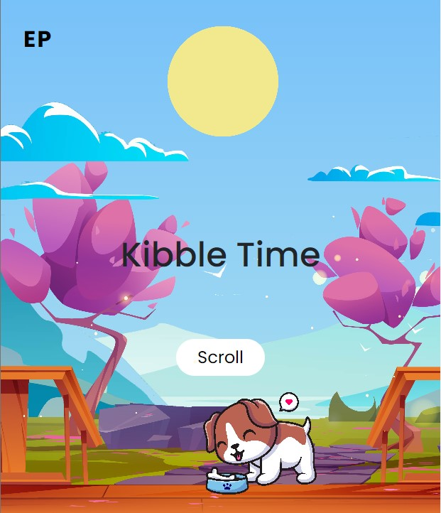

# Kibble Time 

## Description 
- React app that serves react-redux commands on a single webpage. 
- Website: [http://kibbletime-env.eba-m7k7mg3k.us-west-2.elasticbeanstalk.com/](http://kibbletime-env.eba-m7k7mg3k.us-west-2.elasticbeanstalk.com/)

## Functionality 
- SMS commands:
    - Status: Check on pet's lunch and dinner status.
    - Lunch done: Set pet's lunch status to ALREADY FED.
    - Lunch reset: Reset pet's lunch status to NOT FED.
    - Dinner done: Set pet's dinner status to ALREADY FED.
    - Dinner reset: Reset pet's lunch status to NOT FED.

## Features:
- Automatic reset of lunch and dinner status after every 24 hour interval.  

## API  
- Backend API [Flask](https://flask.palletsprojects.com/en/2.2.x/)
- Frontend Framework [Bootstrap 5.2](https://getbootstrap.com/docs/5.2/getting-started/introduction/)
- SQL Database [Amazon RDS](https://aws.amazon.com/rds/)
- SQL ORM [SQLAlchemy](https://www.sqlalchemy.org/)
- SMS Comunnication API [Twilio](https://www.twilio.com/)
- Hosted on [AWS Elastic Beanstalk](https://docs.aws.amazon.com/elastic-beanstalk/index.html)
